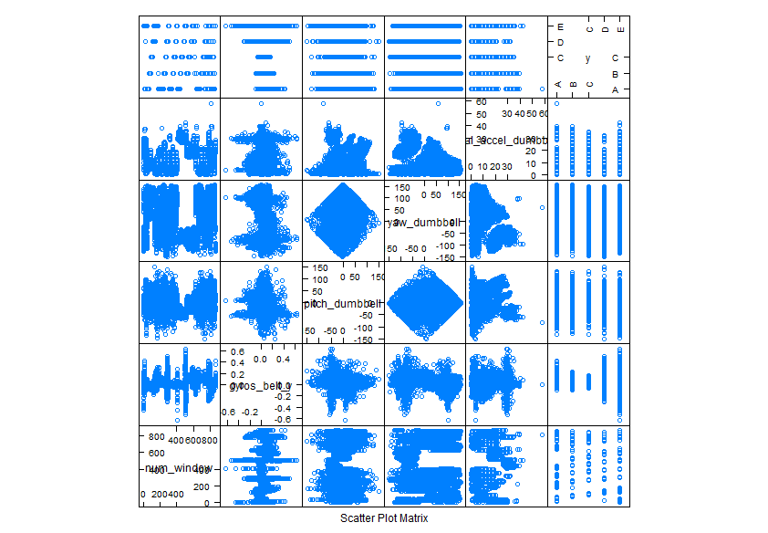

Predicting the manner in which a barbell lifts exercise was done.
===================================================================

### Hayford Tsikata

### July 25, 2014

```{r include =FALSE,cache=TRUE}
 library(caret)
 library(ggplot2)
 library(forecast)
 library(Hmisc)
 library(xtable)
 library(e1071)
 library(knitr)
 library(Hmisc)


### Get data from source and save on local disk.

# trainUrl<- "https://d396qusza40orc.cloudfront.net/predmachlearn/pml-training.csv";
# traindata <- read.csv(trainUrl,as.is=TRUE);
# testUrl <- "https://d396qusza40orc.cloudfront.net/predmachlearn/pml-testing.csv";
# testdata <- read.csv(testUrl, as.is = TRUE)
# save(traindata, file="traindata"); # save data on local drive.
# save(testdata, file="testdata");

```
# Introduction

Six health participants were supervised to perform a weight lifting exercise according to various specifications. The exercise was classified according to whether the  participants performed it exactly as specified or otherwise.
 The varous specifications include: class A; exactly according to the specification, class B; throwing the elbows to the   front, class C; lifting the dumbbell only halfway, class D; lowering the dumbbell only halfway and class E; throwing the hips to the front.
 
The participants were monitored and various parameters were recorded on how they performed the exercise. More information about this exercise, the data and the measured variables can be found at http://groupware.les.inf.puc-rio.br/har 
 
The main objective of this analysis is to predict the manner in which the exercise was done.

   
```{r ,cache=TRUE}
   set.seed(7777)   
   load("traindata");
   load("testdata");
   testing <-testdata;     
   training <- traindata;

```

# Methods
### Feature extraction:

```{r ,cache=TRUE}

  tempTraining <- training[ , colSums(is.na(training)) == 0]; # remove all columns with NAs from the training set
 
  novar <- nearZeroVar(tempTraining,saveMetrics=TRUE);        # checking variables which have zero variances.
  
  indexColsToRemove <- c(1,2,5:6,12:20,43:48,52:60,74:82)     # columns to further remove from the dataframe.
 
  tempTraining <-tempTraining[,-indexColsToRemove];
 
  d1 <- dim(training);

  d2 <- dim(tempTraining);

  corr<- cor(tempTraining[,1:55]);  # calculate the correction of the predictor variables
 
  novar <- nearZeroVar(tempTraining,saveMetrics=TRUE);   # look out for variables with high variance
  
  highVarianceIndex = c(1,3,9,31,32,33,56);             # variables with high percentUnique(above 70%). 
        
  tempTraining <- tempTraining[, highVarianceIndex];
  
  classe <- as.factor(tempTraining$classe);
  
  finalTraining <-data.frame(classe,tempTraining[,-7]);

  d3 <- dim(finalTraining);  # this leaves 19622 X 7 as the final training set 
  
  finalTesting <- subset(testing,select=c("raw_timestamp_part_1","num_window","gyros_belt_y","pitch_dumbbell",  "yaw_dumbbell","total_accel_dumbbell"));

```
The data provided has 159 predictors and 19622 records. After careful exploration, only few variables seem to explain most of the variation in the manner in which the barbell lifts exercise was conducted, which is the **classe** response variable.

Below is a list of the extracted features(measurements) which explain most of the variation in the variable of interest (the **classe** variable).
For more for information on how features were extracted, view the source code at **https://github.com/htsikata/Analytics** 


1. raw_timestamp_part_1
2. num_window
3. gyros_belt_y
4. pitch_dumbbell
5. yaw_dumbbell
6. total_accel_dumbbell

This reduced the dimension of the original training data set from `r d1` to `r d3`. 

The figure below shows a feature plot of each each of the predictor variables in the resulting training data set against the classe variable which is the outcome of interest. 

```{r cache=TRUE, echo=FALSE}

# featurePlot(x=finalTraining[,c(2,3,4,5,6)],y= finalTraining$classe,plot="pairs")

```



It is observed that the variation in the response variable is mostly explained by each of the predictor variables. A lot of the predictor variables can justifiably be ignored and no significant impact will be made on the vaiable of interest(the **classe** variable). The elimination of these predictors does not only enhance the model building, but it also speeds up the computation.


### cross-validation:

In order to better estimate out of sample error,a two-fold cross-validation approach is adopted. The original training data set is split into a sub training and testing sets with about 75 percent in the training set.
This strategy was adopted in order to get a better idea of what the out of sample error will be since resubstitution error may be misleading.

A model is then built on this sub training set and evaluation is done on the sub testing set.
This procedure was repeated with varying percentages (60-90%) of the data in the sub training set. 
The out of sample error was estimated by averaging the errors produced by each of these models.
Only one instance of the training models on the sub training data is included in this report.
This is shown below.

```{r,cache=TRUE}
  inTrain <-createDataPartition(y=finalTraining$classe, p=.70,list = FALSE);

  cvTraining <- finalTraining[inTrain, ];

  cvTesting <- finalTraining[-inTrain, ];

  t1 <- dim(cvTraining);

  t2 <- dim(cvTesting);
```
A model is built on the sub training set using the train() function in the caret package and the random forest method 
with a train control option to use cross validation. This option reports an error which could be used to estimate the out of sample error. 
 
```{r, cache=TRUE}
  cvmodelFit <- train(classe ~. , method="rf", trControl = trainControl(method='cv'), data=cvTraining);

  predictInSample <- predict(cvmodelFit, newdata = cvTraining); 

  predictOutSample <- predict(cvmodelFit, newdata = cvTesting);

  confInSample <- confusionMatrix(predictInSample, cvTraining$classe);

  confOutSample <- confusionMatrix(predictOutSample, cvTesting$classe);

```
# Results
 The accuracy of the model is evaluated using the confusion matrix which shows the number of predictions missed 
 and the number captured correctly.
 The predictions and the resubstitution(in-sample) accuracy  for the sub testing data set are given below.
 
 
```{r cache =TRUE}
  confInSample$table

  confInSample$overall

```

It is observed that the resubstitution accuracy of the model is exactly 1.0000 which means the the model predicted as exactly as the values in the sub training set.
 
The confusion matrix and accuracy of the model on the out of sample test data set is shown below:
```{r cache =TRUE}
  confOutSample$table

  confOutSample$overall

```
Again the level of accuracy is high indicating  that the model is robust on the out of sample sub testing data.

Now, a final model is built on the whole training set. This model will be applied to the twenty out of sample test cases.

```{r cache =TRUE}

  finalModFit <- train(classe ~.,method="rf",trControl=trainControl(method='cv'),data=finalTraining);

  inSample <- predict(finalModFit, newdata = finalTraining);

  confMatrix <- confusionMatrix(inSample, finalTraining$classe);
  
  finalPredictions <- predict(finalModFit,newdata = finalTesting)

```

  The results of the predictions and accuracy on the training set is shown below:
```{r cache=TRUE} 

  confMatrix$table
  
  confMatrix$overall

```
  The error of predicting on the training set is practically zero as seen above. The model correcltly classified all the cases into their right classes. Since the model is built with a cross validation option in the train() function,
  the expected **out of sample error** as reported by this model is **zero**, though its practicality may be questionable.
  
   Finally, the model is applied to each of the given out of sample records or cases and the predictions for each case are diplayed below in order  of case number, that is from case 1 to case 20.
   
```{r cache=TRUE}

  finalPredictions

```

# Conclusion
From the results produced and the accompanying levels of accuracy for the model, the model can be considered reliable and similar levels of accuracy can be expected if applied to new or out of sample datasets.

This claim of robustness is suported by the  confidence interval produced by the model in the results section. This interval (0.9998,1.0000), is indeed small enough to guarantee that most predictions  made by appying this model will equal the actual values.

Finally, this model is likely to produce good results on other data sets from similar experiments with same predictors with a minimal change of parameters.


references 
------------------
 http://groupware.les.inf.puc-rio.br/har
 
 https://d396qusza40orc.cloudfront.net/predmachlearn/pml-training.csv
 
 https://d396qusza40orc.cloudfront.net/predmachlearn/pml-testing.csv
 
 http://caret.r-forge.r-project.org/
